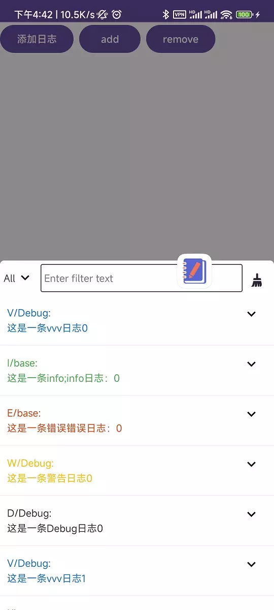

# Slog

## 初始化

```kotlin

SLog.init(this)

```

## 开启和关闭

```kotlin
SLog.getInstance().start()
```

```kotlin
SLog.getInstance().stop()
```

## 添加日志

### 方式一

```kotlin
SLog.v("这是一条日志日志日志")
```

### 方式二

use Timber,

```Kotlin
class SLogTree : Timber.Tree() {

    private val slog: SLog = SLog.getInstance()
    private val defaultTag = "log"

    override fun log(priority: Int, tag: String?, message: String, t: Throwable?) {
        val tag = tag ?: defaultTag

        when (priority) {
            Log.VERBOSE -> slog.v(tag, message)
            Log.INFO -> slog.i(tag, message)
            Log.DEBUG -> slog.d(tag, message)
            Log.WARN -> slog.w(tag, message)
            Log.ERROR -> slog.e(tag, message)
            else -> slog.v(tag, message)
        }
    }
}
Timber.plant(SLogTree())
```

## 添加日志到文件

```kotlin
SLog.getInstance().logWithFile(VERBOSE, "logFile", "这是一条错误VERBOSE日志")
SLog.getInstance().logWithFile(DEBUG, "logFile", "这是一条错误DEBUG日志")
SLog.getInstance().logWithFile(INFO, "logFile", "这是一条错误INFO日志")
SLog.getInstance().logWithFile(WARN, "logFile", "这是一条错误WARN日志")
SLog.getInstance().logWithFile(ERROR, "logFile", "这是一条错误ERROR日志")
```

文件命名：`[TAG]MM-dd HH时mm分`

> 按TAG和每分钟进行输出文件，方便查找
>
> 所以需要合理使用TAG,进行日志文件输出

## 效果图片

| 效果图片                    | 日志展示 1              | 日志展示 2              | 日志文件管理             | Logo长按菜单           |
|-------------------------|---------------------|---------------------|--------------------|--------------------|
|  |  |  |  |  |

## 接入

[](https://jitpack.io/#SheTieJun/LogKit)

Step 1. Add it in your root build.gradle at the end of repositories:

	allprojects {
		repositories {
			...
			maven { url 'https://jitpack.io' }
		}
	}

Step 2. Add the dependency

	dependencies {
	    debugImplementation 'com.github.SheTieJun.LogKit:logkit-debug:tag'
        releaseImplementation 'com.github.SheTieJun.LogKit:logkit-release:tag'
	}

## 夸应用输出日志 -[相关文档](messenger)

- 需要解决在Android >11上 bindService 失败的问题：应用可见性

## ToDo

- [X] ~~增加通过悬浮球关闭整个日志功能 : 长按弹窗关闭~~